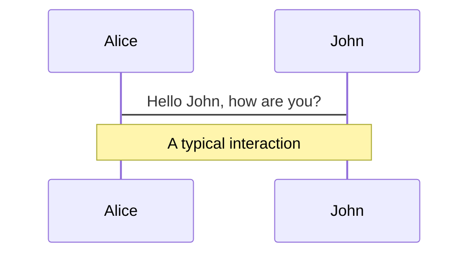
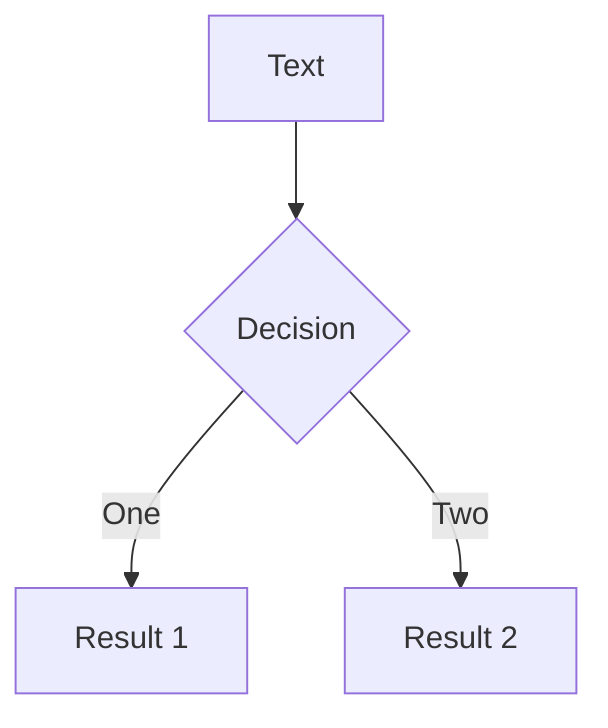

# Mermaid 图表

通过文本描述创建图表。

## 基础用法

````md

````

## 搭配选项

````md

````

## 图表类型

- `graph` / `flowchart` - 流程图
- `sequenceDiagram` - 时序图
- `classDiagram` - 类图
- `stateDiagram` - 状态图
- `erDiagram` - 实体关系图
- `gantt` - 甘特图
- `pie` - 饼图

## 资源

- Mermaid 文档：https://mermaid.js.org/
- 在线编辑器：https://mermaid.live/
