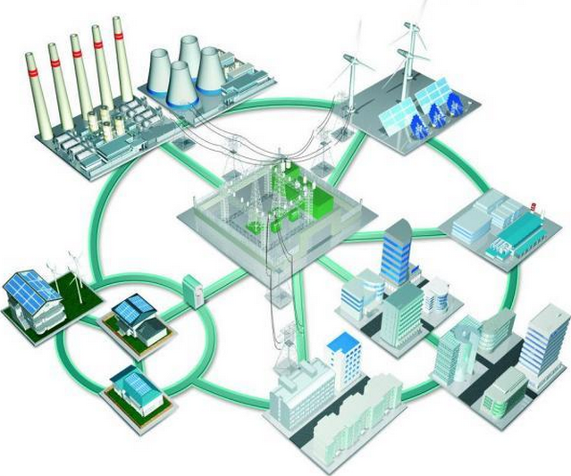

# Part 1
## 为什么需要智慧能源？

<!-- 从一个现实问题引入：电力是怎么"用不好"的？ -->

---
layout: default
---

# 能源系统正面临前所未有的挑战

### 三大核心矛盾

<v-clicks depth="2">

1. **供需不确定性上升**
   - 风能、光伏出力随天气剧烈波动
   - 2023年全球弃风弃光损失超过 **150 TWh**

2. **需求侧日趋复杂**
   - 电动汽车充电、数据中心用电急增
   - 用电峰谷差不断扩大

3. **传统方法力不从心**
   - 统计模型（ARIMA）难以捕捉非线性规律
   - 物理模型对实时变化响应滞后

</v-clicks>

<!-- 强调：不是为了用深度学习而用，而是问题本身驱动了技术选择 -->

---
layout: default
---

# 传统方法的乏力
 

经典工具在新挑战面前接连碰壁

 

 

 

  📉
  

    <h3 class="text-red-400 font-bold mb-1">统计模型（ARIMA / 回归）</h3>
    
线性假设无法捕捉负荷的非线性与突变；高维多变量场景下陷入"维度诅咒"；对节假日、极端天气等结构性突变毫无感知

  

 

  ⚙️
  

    <h3 class="text-red-400 font-bold mb-1">传统优化（线性规划 / 凸优化）</h3>
    
依赖专家手工规则与凸函数假设，难以处理离散变量与动态约束；求解实时调度时计算代价过高

  

 

 

 

  🌊
  

    <h3 class="font-bold mb-1">浅层机器学习（SVM / 随机森林）</h3>
    
需要大量人工特征工程；时序长程依赖建模能力弱；对空间拓扑结构（如电网节点关系）无法端到端学习

  

 

  🔒
  

    <h3 class="text-red-400 font-bold mb-1">规则驱动系统（EMS / SCADA）</h3>
    
规则由人工维护，无法自适应电网拓扑变化；在新型分布式场景下扩展性极差，难以覆盖长尾故障模式

  

 

 

---
layout: default
---

# 深度学习的优势
 

从感知数据，到理解时序，到驱动决策——形成完整的智能闭环

 
<!-- 贯穿三列的连接线 -->

 

 
  <!-- 列 1 -->
  

    

      

      感知 · 建模
    

    <h3 class="text-white font-bold text-lg mb-2">捕捉时序规律</h3>
    

      能源数据天然是时间序列——负荷有日周期、周周期，也有难以预判的突变。深度学习能从原始数据中自动提取这些模式，无需人工设计特征，也无需对数据做线性假设。
    

  

 
  <!-- 列 2 -->
  

    

      

      预测 · 推断
    

    <h3 class="text-white font-bold text-lg mb-2">量化不确定性</h3>
    

      智慧能源的预测不能只给一个点估计——调度需要知道误差有多大、极端情景有多可能。深度学习可以输出概率分布与区间预测，让不确定性本身成为决策的输入。
    

  

 
  <!-- 列 3 -->
  

    

      

      优化 · 决策
    

    <h3 class="text-white font-bold text-lg mb-2">驱动实时决策</h3>
    

      预测的终点是决策。深度学习可以将预测结果与调度目标直接耦合，在储能管理、需求响应、故障检测等场景中替代静态规则，实现自适应的实时控制。
    

  

 

 

  三个层次并非孤立模块——特征学习的质量决定预测上限，预测的不确定性直接塑造决策策略，构成数据→预测→决策的端到端智能链路。

