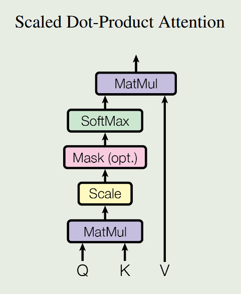
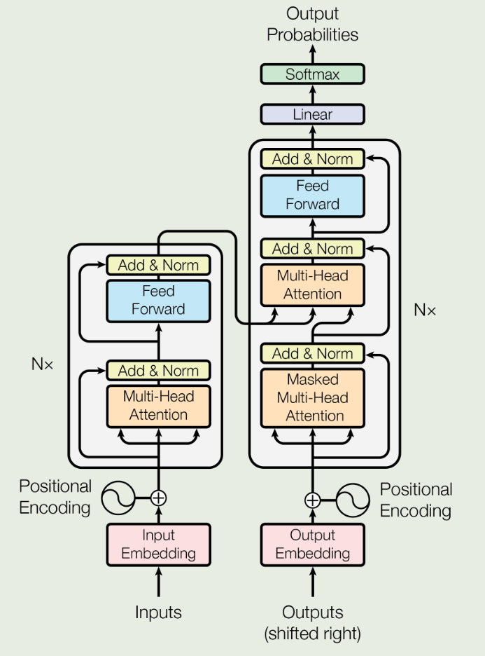

# Part 3
## Transformer 与智慧能源

<!-- Transformer：用"注意力"替代"记忆"，一次看全整段序列 -->

---
layout: two-cols
class: my-auto
---

# Transformer 的核心：自注意力机制

Transformer 来自 2017 年 Google 的论文  
**"Attention is All You Need"**（Vaswani et al.）

**核心思想**：序列中的每个位置，都能直接"关注"到其他任意位置，无需逐步传递。

**自注意力计算**：

$$\text{Attention}(Q, K, V) = \text{softmax}\!\left(\frac{QK^\top}{\sqrt{d_k}}\right)V$$

- $Q$（Query）：当前位置"想要什么"
- $K$（Key）：其他位置"提供什么"
- $V$（Value）：实际携带的信息

::right::




---
layout: default
---

# Transformer 用于能源预测的架构

<div class="mt-2 grid grid-cols-2 gap-6">

<div>

### 标准 Encoder-Decoder 架构



> 🔍 能源领域常用变体：**Informer**（2021）、**PatchTST**（2023）、**iTransformer**（2024）

</div>

<div>

### PyTorch 简单实现

````md magic-move
```python
import torch.nn as nn

class EnergyTransformer(nn.Module):
    """
    初始化参数说明：
    - input_size: 每个时间步的输入特征数（如负荷、温度、湿度等）
    - d_model: Transformer 内部隐藏表示维度
    - pred_len: 需要预测的未来时间步长度
    """
    def __init__(self, 
                input_size=8, 
                d_model=64,   
                pred_len=24): 
        super().__init__()
        # 输入投影
        self.input_proj = nn.Linear(input_size, d_model)
        self.output_proj = nn.Linear(d_model, pred_len)
```

```python
import torch.nn as nn

class EnergyTransformer(nn.Module):
    def __init__(self, input_size=8, d_model=64,
                 nhead=8,       # 多头注意力头数
                 num_layers=2,  # 编码器层数
                 pred_len=24):  # 预测步长
        super().__init__()
        self.input_proj = nn.Linear(input_size, d_model)

        # Transformer 编码器
        encoder_layer = nn.TransformerEncoderLayer(
            d_model=d_model,
            nhead=nhead,
            dim_feedforward=256,
            dropout=0.1,
            batch_first=True
        )
        self.encoder = nn.TransformerEncoder(
            encoder_layer, num_layers=num_layers)
        self.output_proj = nn.Linear(d_model, pred_len)
```

```python
import torch.nn as nn

class EnergyTransformer(nn.Module):
    def __init__(self, input_size=8, d_model=64,
                 nhead=8, num_layers=2, pred_len=24): 
        super().__init__()
        self.input_proj = nn.Linear(input_size, d_model)
        encoder_layer = nn.TransformerEncoderLayer(
            d_model=d_model, nhead=nhead, 
            dim_feedforward=256,
            dropout=0.1, batch_first=True
        )
        self.encoder = nn.TransformerEncoder(
                encoder_layer, num_layers=num_layers)
        self.output_proj = nn.Linear(d_model, pred_len)

    def forward(self, x):
        # x: (batch, seq_len, features)
        x = self.input_proj(x)
        h = self.encoder(x)
        return self.output_proj(h[:, -1, :])
```
````

</div>
</div>

---
layout: default
---

# 应用案例：光伏发电量预测

<div class="mt-2">

**任务**：利用历史功率 + 气象数据（辐照度、温度、云量），预测未来 24~48 小时光伏电站出力。

</div>

<div class="grid grid-cols-2 gap-6 mt-3">

<div>

### 为什么 Transformer 更适合这个任务？

**光伏功率的特点**：
- 受天气影响，具有**长程周期性**（今天正午与昨天正午高度相关）
- 云遮蔽造成**突变**，短时波动大
- 多气象变量之间有**复杂交互**

Transformer 的注意力机制能跨越长时间窗口直接建立关联，特别适合捕捉 **"今天中午 → 昨天中午"** 这类跨天依赖。

> Kim et al. (2024), *Renewable and Sustainable Energy Reviews* —— Transformer 混合模型比单纯 LSTM **误差降低 48.3%**

</div>

<div>

### 预测效果示意

```
光伏功率预测（晴天 vs 多云对比）

MW
5  │    ╭─────╮
   │  ╭╯  晴天 ╰╮    实际 ───
4  │ ╱           ╰╮  预测 ─ ─
   │╱              ╰╮
3  │                ╰──
   │
2  │  多云天（波动大）
   │ ╱╲  ╱╲  ╱╲  ╱
1  │╱  ╲╱  ╲╱  ╲╱
   └─────────────────→ 时 (h)
    6   9   12  15  18

评估指标（典型水平）：
  R²    ≈ 0.92 ~ 0.97（晴天）
  MAPE  ≈ 3% ~ 8%（多云）
```

<div class="text-sm text-gray-500 mt-2">

📌 配图参考（论文截图）：  
https://www.mdpi.com/1996-1073/17/17/4426  
（TransPVP, Fig. 5 光伏预测对比图，MDPI Energies 2024）

</div>

</div>
</div>

---
layout: default
---

# 能源领域专用 Transformer 变体：Informer

<div class="grid grid-cols-2 gap-6 mt-3">

<div>

### 标准 Transformer 的瓶颈

标准自注意力复杂度为 $O(L^2)$，序列长度 $L$ 翻倍则计算量翻四倍。

对于能源预测，往往需要处理**数周**的历史数据（序列长度数千步），标准 Transformer 计算代价极高。

### Informer 的解决思路（Zhou et al., 2021, AAAI）

引入 **ProbSparse Self-Attention**：

$$\text{只保留注意力分数最高的} k \text{ 个 Query}$$

复杂度降为 $O(L \log L)$，在保持精度的同时支持**超长序列预测**（Long-term Forecasting）。

</div>

<div>

### 实验对比（ETT 能源数据集）

| 模型 | 预测 48h | 预测 720h |
|------|---------|---------|
| LSTM | MSE 0.752 | — (失败) |
| Informer | MSE 0.577 | MSE 0.891 |
| PatchTST | MSE 0.421 | MSE 0.668 |
| iTransformer | **MSE 0.388** | **MSE 0.612** |

> ETT（Electricity Transformer Temperature）是常用能源时序基准数据集

<div class="mt-3 text-sm text-gray-500">

📌 配图参考：  
https://arxiv.org/html/2408.16202v2  
（综述 Fig. 负荷预测模型对比，arXiv 2024）

</div>

</div>
</div>

---
layout: default
---

# 注意力可视化：模型"看到了什么"？

<div class="mt-3 grid grid-cols-2 gap-6">

<div>

Transformer 一个独特优势是**可解释性**：通过可视化注意力权重，可以直观看到模型在预测时关注了哪些历史时刻。

### 典型发现

在电力负荷预测中，注意力图常显示：

- **同一天的前7天**（上周同一工作日）权重最高
- **前一天同时段**次之
- **节假日边界**处权重有异常

这与领域专家的经验一致：负荷具有**日周期性**和**周周期性**。

> 注意力权重为模型提供了一种"自解释"能力，在电力行业部署中有重要价值

</div>

<div>

### 注意力热力图示意

```
注意力权重矩阵（预测目标 vs 历史时刻）

查询时刻 ↓ / 历史时刻 →
         -168h -48h -24h -1h  now
今日8时  [ 0.8  0.3  0.7  0.4  0.1 ]
今日12时 [ 0.6  0.2  0.8  0.3  0.1 ]
今日18时 [ 0.7  0.4  0.6  0.5  0.2 ]

颜色越深 = 注意力越强
■■■□□  ← 上周同时段（-168h）最受关注
■□■□□  ← 昨天同时段（-24h）次之
```

<div class="mt-3 border-l-4 border-purple-400 pl-3 text-sm">

💡 这种可解释性在实际电力系统部署中尤为重要——调度员需要理解模型"为什么这么预测"，才愿意信任并采用

</div>

</div>
</div>
