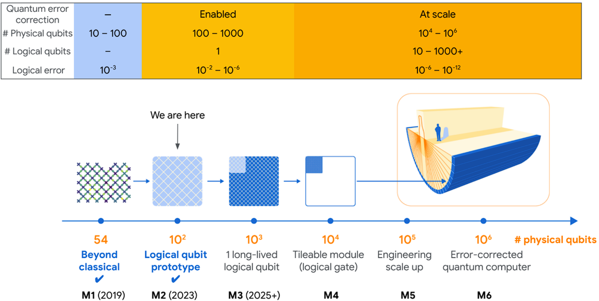

# 量子纠错的工程化拐点

## 从物理量子比特到逻辑量子比特

<!--
开场说明：这次展示关注量子纠错为什么成为近三年量子计算工程化的核心问题。
-->

---
layout: default
---

# 近三年量子计算的前沿转向

近三年量子计算领域的一个重要变化，是研究重点逐渐从展示物理量子比特数量、随机线路采样或基础算法，转向如何构建真正可靠的量子计算单元。

现实中的量子比特极易受到噪声、退相干、门操作误差和测量误差影响。如果这些错误不能被持续检测和修正，量子计算机就无法执行足够长、足够复杂的计算。

**因此，量子纠错正在成为通向实用量子计算的关键工程路线。**

<!--
讲这一页时把“更多物理比特”和“更可靠逻辑比特”的方向变化讲清楚即可。
-->

---
layout: default
---

# 大规模量子算法的硬件可靠性瓶颈

Shor 算法、Grover 算法等基础算法已经说明，量子计算在理论上可能具有巨大优势。但这些算法真正运行到实际问题规模时，需要大量量子门操作和很长的量子线路。

当前量子硬件的问题在于，每一次量子门、每一次测量、每一段等待时间都可能引入错误。对于短线路，这些错误还可以暂时容忍；对于有实际价值的大规模计算，错误会迅速累积，最终让结果失去意义。

**所以，近三年的前沿并不只是提出一个新算法，而是解决“如何让量子计算可靠运行”的底层问题。**

理论算法与实际硬件之间，卡着错误率瓶颈。

<!--
这一页强调：算法优势已经存在，真正的限制来自硬件错误率和长线路中的错误累积。
-->

---
layout: default
---

# 从物理量子比特到逻辑量子比特的编码转换

物理量子比特是量子芯片上真实存在的硬件单元，例如超导量子芯片中的超导电路量子比特。它们本身非常脆弱，可能因为环境噪声、控制误差或测量误差而发生错误。

逻辑量子比特不是单个硬件比特，而是由多个物理量子比特共同编码形成的信息单元。量子纠错的目标不是让每一个物理量子比特完美无误，而是让整体编码后的逻辑量子比特比任何单个物理量子比特更可靠。

由于量子态不能被直接复制，也不能随意测量，量子纠错通常通过测量错误症状来判断系统中可能发生的错误，同时尽量不破坏真正承载信息的量子态。

  
  
  
  
  
  
  
  
  
  
  
  
  
  
  
  
  
  
  
  
  
  
  
  
  

→

逻辑比特

<!--
这里重点讲清“逻辑量子比特不是一个更好的物理器件，而是一种编码后的信息单元”。
-->

---
layout: default
---

# 表面码与二维量子芯片的结构适配

表面码可以理解为一种二维网格结构的量子纠错码。它把量子信息分散编码在许多物理量子比特上，并通过周期性测量局部稳定子来获得错误症状。

表面码的重要性在于，它主要依赖相邻量子比特之间的局部操作，因此比较适合二维排列的超导量子芯片。图中的数据量子比特负责承载编码信息，测量量子比特负责检查周围区域是否出现异常。

**码距越大，理论上能够容忍的错误越多，但同时需要更多物理量子比特。**

<!--
这一页把表面码讲成二维网格和局部检查机制，不需要展开复杂公式。
-->

---
layout: default
---

# 量子纠错阈值与逻辑错误率缩放

量子纠错并不是简单地把更多物理量子比特堆在一起。如果物理量子比特本身错误率太高，那么增加物理量子比特也会同时增加新的错误来源，最终可能使逻辑量子比特更糟。

所谓阈值，就是一个关键临界点。只有当底层物理错误率低于这个临界点时，扩大纠错码规模才会降低逻辑错误率。

低于阈值的含义

增加码距后，逻辑错误率确实下降。

<!--
用这张趋势图说明“扩大规模带来更低逻辑错误率”才是真正有用的纠错。
-->

---
layout: default
---

# Willow 表面码实验的关键工程结果

Google Quantum AI 在 Willow 超导量子处理器上实现了低于阈值的表面码量子存储实验。论文报告了 distance-5 和 distance-7 两种表面码存储，其中 distance-7 逻辑量子比特使用 101 个物理量子比特。

实验达到每个纠错周期 0.143% ± 0.003% 的逻辑错误率。更关键的是，当码距增加时，逻辑错误率被压低，错误抑制因子达到 2.14 ± 0.02，这说明扩大纠错码规模带来了实际收益。

**实验还展示了实时解码能力，说明量子纠错不仅是量子芯片问题，也依赖高速经典控制和解码系统。**

<!--
这里保留三个关键数字：distance-7、101 个物理量子比特、0.143% 每周期逻辑错误率。
-->

---
layout: default
---

# 从 2023 到 Willow 的纠错扩展路径

2023 年 Google Quantum AI 已经在 Nature 上展示过扩大表面码逻辑量子比特带来的初步收益。当时 distance-5 表面码逻辑量子比特相比 distance-3 逻辑量子比特表现略好，说明扩大纠错码规模开始能够改善逻辑性能。

但这一提升还比较温和，更像是看到了量子纠错扩展的开端。Willow 实验在此基础上进一步推进，展示了 distance-7 表面码，逻辑错误率随码距增加而更明确地下降，并结合了实时解码能力。

**2023 年证明扩大规模开始有用，Willow 则把表面码纠错推进到更清晰的工程阶段。**

<!--
这一页讲时间线：从初步错误抑制，到更明确的低于阈值行为。
-->

---
layout: default
---

# 逻辑量子比特的跨平台发展趋势

虽然 Willow 是超导量子计算路线的代表性成果，但逻辑量子比特并不是超导平台独有的方向。2024 年 Nature 上的一项工作展示了基于可重构中性原子阵列的逻辑量子处理器。

这项工作最多使用 280 个物理量子比特，并在编码逻辑量子比特上实现可编程操作。中性原子平台的优势在于阵列结构可以重构，连接方式更灵活，因此适合探索不同逻辑编码和逻辑操作。

**这说明近三年的趋势不是某家公司或某个平台的孤立突破，而是整个领域正在走向逻辑量子比特。**

<!--
这一页把中性原子平台作为对照，说明“逻辑量子比特”是跨平台共识。
-->

---
layout: default
---

# 迈向通用容错量子计算的剩余挑战

Willow 的结果并不意味着实用量子计算已经完成。首先，目前主要展示的是逻辑量子存储，也就是让逻辑量子比特更稳定地保存信息；完整的通用容错量子计算还需要大量逻辑量子比特之间的高保真逻辑门。

其次，实时解码会成为重要瓶颈，因为量子芯片会不断产生错误症状数据，经典系统必须快速判断错误并给出修正策略。

再次，表面码虽然成熟，但物理量子比特开销很大。如果未来需要构建成百上千个逻辑量子比特，可能需要更低开销的纠错码，例如 qLDPC 码。

最后，真实硬件中的错误并不总是独立简单的，串扰、泄漏错误和罕见相关错误仍可能影响纠错效果。

<!--
这一页避免过度解读 Willow：它是重要进展，但还不是完整通用容错量子计算。
-->

---
layout: default
---

# 可靠逻辑量子比特是实用化基础

逻辑

量子比特

这次展示的核心结论是，有用的大规模量子计算不能只依赖更多物理量子比特，而必须依赖更可靠的逻辑量子比特。

Google Willow 的表面码实验之所以重要，是因为它展示了低于阈值的量子纠错行为，也就是当纠错码规模增加时，逻辑错误率确实下降。这标志着量子计算从 NISQ 阶段走向容错阶段的关键进展。

未来几年，量子计算的竞争重点很可能集中在逻辑量子比特数量、逻辑门质量、实时解码能力和纠错开销控制上。

<!--
最后用一句话收束：量子纠错是把量子计算从实验演示推向可靠工程系统的核心路径。
-->

---
layout: default
---

# 参考文献

- [1] Google Quantum AI and Collaborators, Nature 638, 920-926, 2025.
- [2] Google Quantum AI, Nature 614, 676-681, 2023.
- [3] D. Bluvstein et al., Nature 626, 58-65, 2024.
- [4] J. Bausch et al., Nature 635, 834-840, 2024.
- [5] S. Bravyi et al., Nature 627, 778-782, 2024.
- [6] R. Mandelbaum, IBM Quantum Blog, Jun. 2025.

<!--
参考文献单独成页，便于结尾页保持总结聚焦。
-->
