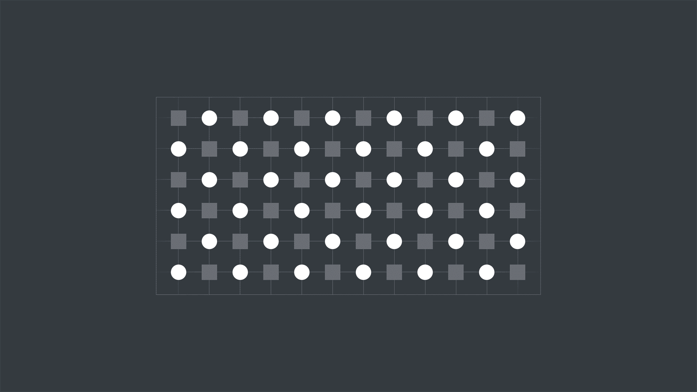

# 量子纠错的工程化转折

## 从物理量子比特到逻辑量子比特

<div class="mt-8 text-base leading-7">
<div><span class="font-700">PPT 演讲：</span>雷显秋</div>
<div><span class="font-700">信息收集：</span>丁兆言、唐若恒</div>
</div>

<!--
开场说明：这次展示关注量子纠错为什么成为近三年量子计算工程化的核心问题。
-->

---
layout: center
section: 从 grover 讲起
---

# 从 Grover 讲起

<!--
这一页只做章节标题，提示接下来先用一个最小 Grover 算法引入。
-->

---
layout: default
---

# 问题描述：从 8 个候选态中找到 |111>

<div class="grid grid-cols-[0.95fr_1.05fr] gap-8 items-center">
<div class="text-lg leading-8">

Grover 搜索要解决的问题可以先压缩成一个 3 比特版本：在 8 个候选态中，找出被 oracle 标记的目标态。

1. 先用 Hadamard 门准备均匀叠加态，让 8 个候选态同时参与计算。  

  $$
  \frac{1}{\sqrt{8}}(\lvert 000\rangle+\lvert 001\rangle+\cdots+\lvert 111\rangle)
  $$

2. oracle 不直接告诉我们答案，而是给目标态 `|111>` 加上相位标记。  

  $$
  \frac{1}{\sqrt{8}}(\lvert 000\rangle+\lvert 001\rangle+\cdots+\lvert 110\rangle-\lvert 111\rangle)
  $$

3. 两轮振幅放大把目标态的测量概率推高到约 94.5%，最后通过多次测量读出最高频答案。


</div>

<div class="grid grid-cols-4 gap-3 text-center text-lg font-700">
<div class="flex h-20 items-center justify-center rounded border border-gray-300">|000&gt;</div>
<div class="flex h-20 items-center justify-center rounded border border-gray-300">|001&gt;</div>
<div class="flex h-20 items-center justify-center rounded border border-gray-300">|010&gt;</div>
<div class="flex h-20 items-center justify-center rounded border border-gray-300">|011&gt;</div>
<div class="flex h-20 items-center justify-center rounded border border-gray-300">|100&gt;</div>
<div class="flex h-20 items-center justify-center rounded border border-gray-300">|101&gt;</div>
<div class="flex h-20 items-center justify-center rounded border border-gray-300">|110&gt;</div>
<div class="flex h-20 flex-col items-center justify-center rounded border-2 border-blue-500 bg-blue-50 text-blue-700">
<div>|111&gt;</div>
<div class="mt-1 text-xs font-400">oracle 标记</div>
</div>
</div>
</div>

<!--
grover 算法老师在之前的讲解中已经讲过了，所以我在这里就不展开细节，直接抛出一个问题，并且会在下一页用python中的 qiskit 代码来演示这个问题的实现。
-->

---
layout: default
---

# 代码拆解

````md magic-move {lines: true}
```python
# 导入线路构造、编译工具和 Aer 模拟器
from qiskit import QuantumCircuit, transpile
from qiskit_aer import AerSimulator

# 设置测量次数，并创建 3 个量子比特、3 个经典比特的线路
shots = 1000
grover_rounds = 2

qc = QuantumCircuit(3, 3)
qubits = [0, 1, 2]

# 准备均匀叠加态，让 |000> 到 |111> 这 8 个候选态同时参与搜索
qc.h(qubits)
```

```python
# oracle 标记
for _ in range(grover_rounds):
    # H + CCX + H 会给 |111> 加上负相位
    qc.h(2)
    qc.ccx(0, 1, 2)
    qc.h(2)

    # 振幅放大，通过反射操作提高被标记状态的测量概率
    qc.h(qubits)
    qc.x(qubits)
    qc.h(2)
    qc.ccx(0, 1, 2)
    qc.h(2)
    qc.x(qubits)
    qc.h(qubits)
```

```python
# 测量并交给 AerSimulator 运行
qc.measure(qubits, qubits)

backend = AerSimulator()
compiled = transpile(qc, backend)

# counts 会统计 1024 次测量中每个结果出现了多少次
counts = backend.run(compiled, shots=shots).result().get_counts()

# 打印线路和测量结果
print(qc.draw(output="text",fold=-1))
print(counts)

# 最常出现的比特串就是 Grover 搜索给出的答案
winner = max(counts, key=counts.get)
print(f"Most frequent state: |{winner}> ({counts[winner]}/{shots})")
```
````

<!--
这一页用 Magic Move 拆解 3 比特 Grover 代码模块：导入与建线路、准备 8 个候选态的叠加、两轮 oracle 标记与振幅放大、测量运行和打印结果。
-->

---
layout: default
class: overflow-auto
---

# 3 比特 Grover 搜索

```python {monaco-run} {autorun:false,height:'235px'}
from qiskit import QuantumCircuit, transpile
from qiskit_aer import AerSimulator

shots = 1000
grover_rounds = 1

qc = QuantumCircuit(3, 3)
qubits = [0, 1, 2]

qc.h(qubits)

for _ in range(grover_rounds):
    qc.h(2)
    qc.ccx(0, 1, 2)
    qc.h(2)

    qc.h(qubits)
    qc.x(qubits)
    qc.h(2)
    qc.ccx(0, 1, 2)
    qc.h(2)
    qc.x(qubits)
    qc.h(qubits)

qc.measure(qubits, qubits)

backend = AerSimulator()
compiled = transpile(qc, backend)
counts = backend.run(compiled, shots=shots).result().get_counts()

print(qc.draw(output="text",fold=-1))
print(counts)

winner = max(counts, key=counts.get)
print(f"Most frequent state: |{winner}> ({counts[winner]}/{shots})")
```

<!--
展示两种情况。先运行轮次为1，再运行轮次为2。
-->


---
layout: center
section: 量子计算前沿的工程化转向
---

# 量子计算前沿的工程化转向

<!--
第一部分：说明研究重点为什么从算法演示转向可靠性工程。
-->

---
layout: default
---

# 量子计算的前沿转向

<div class="grid min-h-[350px] grid-cols-[1.05fr_1fr] items-center gap-8">
<div>

近三年量子计算领域的一个重要变化，是研究重点逐渐从展示物理量子比特数量、随机线路采样或基础算法，转向如何构建真正可靠的量子计算单元。

现实中的量子比特极易受到噪声、退相干、门操作误差和测量误差影响。如果这些错误不能被持续检测和修正，量子计算机就无法执行足够长、足够复杂的计算。

**因此，量子纠错正在成为通向实用量子计算的关键工程路线。**

</div>

<div class="text-center">

<div class="mt-3 text-xs text-left leading-4 opacity-65">
Roadmap for building a useful error-corrected quantum computer with key milestones. We are currently building one logical qubit that we will scale in the future.
</div>
</div>
</div>

<!--
讲这一页时把“更多物理比特”和“更可靠逻辑比特”的方向变化讲清楚即可。
-->

---
layout: default
---

# 大规模量子算法的硬件可靠性瓶颈

<div class="grid grid-cols-[0.9fr_1.1fr] gap-8 items-center">
<div class="text-lg leading-8">

Shor 算法、Grover 算法等基础算法已经说明，量子计算在理论上可能具有巨大优势。但这些算法真正运行到实际问题规模时，需要大量量子门操作和很长的量子线路。

当前量子硬件的问题在于，每一次量子门、每一次测量、每一段等待时间都可能引入错误。对于短线路，这些错误还可以暂时容忍；对于有实际价值的大规模计算，错误会迅速累积，最终让结果失去意义。

所以，近三年的前沿并不只是提出一个新算法，而是解决“如何让量子计算可靠运行”的底层问题。

</div>

<div class="text-center">

</div>
</div>

<!--
这一页强调：算法优势已经存在，真正的限制来自硬件错误率和长线路中的错误累积。
-->

---
layout: center
section: 逻辑量子比特与表面码机制
---

# 逻辑量子比特与表面码机制


<!--
第二部分：说明量子纠错如何从物理量子比特构造逻辑量子比特。
-->

---
layout: default
---

# 从物理量子比特到逻辑量子比特的编码转换

<div class="grid grid-cols-[1fr_0.95fr] gap-8 items-center my-25">
<div >

**物理量子比特**是量子芯片上真实存在的硬件单元，例如超导量子芯片中的超导电路量子比特。它们本身非常脆弱，可能因为环境噪声、控制误差或测量误差而发生错误。

**逻辑量子比特**不是单个硬件比特，而是由多个物理量子比特共同编码形成的信息单元。量子纠错的目标不是让每一个物理量子比特完美无误，而是让整体编码后的逻辑量子比特比任何单个物理量子比特更可靠。

由于量子态不能被直接复制，也不能随意测量，量子纠错通常通过测量错误症状来判断系统中可能发生的错误，同时尽量不破坏真正承载信息的量子态。

</div>

<div class="flex items-center justify-center gap-6">
<div class="grid grid-cols-5 gap-2" aria-label="多个物理量子比特">
  <span class="h-5 w-5 rounded-full bg-blue-500 opacity-85"></span>
  <span class="h-5 w-5 rounded-full bg-blue-500 opacity-85"></span>
  <span class="h-5 w-5 rounded-full bg-blue-500 opacity-85"></span>
  <span class="h-5 w-5 rounded-full bg-blue-500 opacity-85"></span>
  <span class="h-5 w-5 rounded-full bg-blue-500 opacity-85"></span>
  <span class="h-5 w-5 rounded-full bg-blue-500 opacity-85"></span>
  <span class="h-5 w-5 rounded-full bg-blue-500 opacity-85"></span>
  <span class="h-5 w-5 rounded-full bg-blue-500 opacity-85"></span>
  <span class="h-5 w-5 rounded-full bg-blue-500 opacity-85"></span>
  <span class="h-5 w-5 rounded-full bg-blue-500 opacity-85"></span>
  <span class="h-5 w-5 rounded-full bg-blue-500 opacity-85"></span>
  <span class="h-5 w-5 rounded-full bg-blue-500 opacity-85"></span>
  <span class="h-5 w-5 rounded-full bg-blue-500 opacity-85"></span>
  <span class="h-5 w-5 rounded-full bg-blue-500 opacity-85"></span>
  <span class="h-5 w-5 rounded-full bg-blue-500 opacity-85"></span>
  <span class="h-5 w-5 rounded-full bg-blue-500 opacity-85"></span>
  <span class="h-5 w-5 rounded-full bg-blue-500 opacity-85"></span>
  <span class="h-5 w-5 rounded-full bg-blue-500 opacity-85"></span>
  <span class="h-5 w-5 rounded-full bg-blue-500 opacity-85"></span>
  <span class="h-5 w-5 rounded-full bg-blue-500 opacity-85"></span>
  <span class="h-5 w-5 rounded-full bg-blue-500 opacity-85"></span>
  <span class="h-5 w-5 rounded-full bg-blue-500 opacity-85"></span>
  <span class="h-5 w-5 rounded-full bg-blue-500 opacity-85"></span>
  <span class="h-5 w-5 rounded-full bg-blue-500 opacity-85"></span>
  <span class="h-5 w-5 rounded-full bg-blue-500 opacity-85"></span>
</div>
<div class="text-4xl font-700 opacity-55">→</div>
<div class="h-30 w-30 rounded-full border-6 border-blue-500 flex items-center justify-center text-xl font-700">
逻辑比特
</div>
</div>
</div>

<!--
这里重点讲清“逻辑量子比特不是一个更好的物理器件，而是一种编码后的信息单元”。
-->

---
layout: default
---

# 表面码

<div class="grid grid-cols-[0.95fr_1.05fr] gap-8 items-center mt-15">
<div class="text-lg leading-8">

**表面码**可以理解为一种二维网格结构的量子纠错码。它把量子信息分散编码在许多物理量子比特上，并通过周期性测量局部稳定子来获得错误症状。

表面码的重要性在于，它主要依赖相邻量子比特之间的局部操作，因此比较适合二维排列的超导量子芯片。图中的数据量子比特负责承载编码信息，测量量子比特负责检查周围区域是否出现异常。

<div class="mt-4 text-blue-600">

**码距越大，理论上能够容忍的错误越多，但同时需要更多物理量子比特。**

</div>
</div>


</div>

<!--
这一页把表面码讲成二维网格和局部检查机制，不需要展开复杂公式。
-->


---
layout: center
section: Willow 表面码实验
---

# Willow 表面码实验


<!--
第三部分：进入 Willow 代表性实验和工程结果。
-->

---
layout: default
---

# 量子纠错阈值

<div class="grid grid-cols-[0.9fr_1.1fr] gap-8 items-center mt-15">
<div class="text-lg leading-8">

量子纠错的关键不只是使用更多物理量子比特，而是看这些物理比特是否足够可靠。扩大编码规模会带来更多检查和冗余，也会引入更多门操作、测量和等待时间。

所谓阈值，就是判断“扩码是否真的有收益”的临界点。只有当底层物理错误率低于阈值时，增加码距才会让逻辑错误率随规模下降；如果高于阈值，更多物理比特反而可能带来更多错误。

<div class="mt-6 grid grid-cols-2 gap-3">
<div class="rounded bg-blue-50 p-4">
<div class="text-xl font-700 text-blue-700">低于阈值</div>
<div class="mt-2 text-base leading-6">增加码距后，逻辑错误率下降。</div>
</div>
<div class="rounded bg-gray-50 p-4">
<div class="text-xl font-700 text-gray-700">高于阈值</div>
<div class="mt-2 text-base leading-6">扩大量子纠错码，未必能换来更可靠的逻辑比特。</div>
</div>
</div>

</div>


</div>

<!--
用这张趋势图说明阈值的意义：只有底层错误率足够低，增加码距才会把逻辑错误率压下去。
-->

---
layout: default
---

# Willow 表面码实验的关键工程结果

<div class="grid grid-cols-[0.92fr_1.08fr] gap-7 items-center mt-20">
<div class="text-lg">

Google Quantum AI 在 Willow 超导量子处理器上实现了低于阈值的表面码量子存储实验。论文报告了 distance-5 和 distance-7 两种表面码存储，其中 distance-7 逻辑量子比特使用 101 个物理量子比特。

实验达到每个纠错周期 0.143% ± 0.003% 的逻辑错误率。更关键的是，当码距增加时，逻辑错误率被压低，错误抑制因子达到 2.14 ± 0.02，这说明扩大纠错码规模带来了实际收益。

实验还展示了实时解码能力，说明量子纠错不仅是量子芯片问题，也依赖高速经典控制和解码系统。

</div>


</div>

<!--
这里保留三个关键数字：distance-7、101 个物理量子比特、0.143% 每周期逻辑错误率。
-->

---
layout: default
---

# 从 2023 到 Willow 的纠错扩展路径

<div class="grid grid-cols-[0.8fr_1.05fr] gap-8 items-center mt-25">
<div class="text-lg leading-8">

2023 年 Google Quantum AI 已经在 Nature 上展示过扩大表面码逻辑量子比特带来的初步收益。当时 distance-5 表面码逻辑量子比特相比 distance-3 逻辑量子比特表现略好，说明扩大纠错码规模开始能够改善逻辑性能。

但这一提升还比较温和，更像是看到了量子纠错扩展的开端。Willow 实验在此基础上进一步推进，展示了 distance-7 表面码，逻辑错误率随码距增加而更明确地下降，并结合了实时解码能力。

</div>


</div>

<!--
2023 年证明扩大规模开始有用，Willow 则把表面码纠错推进到更清晰的工程阶段。
-->

---
layout: center
section: 量子计算的发展挑战
---

# 量子计算的发展挑战


<!--
第四部分：从单一实验结果扩展到平台趋势、剩余挑战和总结。
-->

---
layout: default
---

# 逻辑量子比特的跨平台发展趋势

<div class="grid grid-cols-[0.7fr_1.2fr] gap-8 items-center mt-15">
<div class="text-lg leading-8">

虽然 Willow 是超导量子计算路线的代表性成果，但逻辑量子比特并不是超导平台独有的方向。2024 年 Nature 上的一项工作展示了基于可重构中性原子阵列的逻辑量子处理器。

这项工作最多使用 280 个物理量子比特，并在编码逻辑量子比特上实现可编程操作。中性原子平台的优势在于阵列结构可以重构，连接方式更灵活，因此适合探索不同逻辑编码和逻辑操作。


**这说明近三年的趋势不是某家公司或某个平台的孤立突破，而是整个领域正在走向逻辑量子比特。**

</div>


</div>

<!--
这一页把中性原子平台作为对照，说明“逻辑量子比特”是跨平台共识。
-->

---
layout: default
---

# 迈向通用容错量子计算的挑战

<div class="grid grid-cols-[0.95fr_1.05fr] gap-7 items-center mt-10">
<div class="text-base leading-7">

Willow 的结果并不意味着实用量子计算已经完成。

首先，目前主要展示的是逻辑量子存储，也就是让逻辑量子比特更稳定地保存信息；完整的通用容错量子计算还需要大量逻辑量子比特之间的高保真逻辑门。

其次，实时解码会成为重要瓶颈，因为量子芯片会不断产生错误症状数据，经典系统必须快速判断错误并给出修正策略。

再次，表面码虽然成熟，但物理量子比特开销很大。如果未来需要构建成百上千个逻辑量子比特，可能需要更低开销的纠错码。

最后，真实硬件中的错误并不总是独立简单的，串扰、泄漏错误和罕见相关错误仍可能影响纠错效果。

</div>


</div>

<!--
图里主要在讲 实时解码的工程问题。

图 a表示错误症状数据是连续产生的，解码器要边接收边处理。

图 b表示把解码任务拆分、合并、并行处理。

图 c直接展示解码延迟，这正对应“经典系统必须快速判断错误”。

图 d说明不同解码方式会影响逻辑错误率。
-->

---
layout: default
---

# 总结

<div class="grid grid-cols-[2fr_1.4fr] items-center mt-20">
<div class="text-center">

</div>

<div>

这次展示的核心结论是，有用的大规模量子计算不能只依赖更多物理量子比特，而必须依赖更可靠的逻辑量子比特。

Google Willow 的表面码实验之所以重要，是因为它展示了低于阈值的量子纠错行为，也就是当纠错码规模增加时，逻辑错误率确实下降。这标志着量子计算从 NISQ (Noisy Intermediate-Scale Quantum) 阶段走向容错阶段的关键进展。

未来几年，量子计算的竞争重点很可能集中在逻辑量子比特数量、逻辑门质量、实时解码能力和纠错开销控制上。

</div>
</div>

<!--
含噪声中等规模量子阶段
-->

---
layout: default
---

# 参考文献

<div class="mt-14 w-[90%] leading-6 mx-auto">

[1] Google Quantum AI and Collaborators, “Quantum error correction below the surface code threshold,” Nature, vol. 638, pp. 920–926, 2025, doi: 10.1038/s41586-024-08449-y.

[2] Google Quantum AI, “Suppressing quantum errors by scaling a surface code logical qubit,” Nature, vol. 614, pp. 676–681, 2023, doi: 10.1038/s41586-022-05434-1.

[3] D. Bluvstein et al., “Logical quantum processor based on reconfigurable atom arrays,” Nature, vol. 626, pp. 58–65, 2024, doi: 10.1038/s41586-023-06927-3.

[4] J. Bausch, A. W. Senior, F. J. H. Heras, et al., “Learning high-accuracy error decoding for quantum processors,” Nature, vol. 635, pp. 834–840, 2024, doi: 10.1038/s41586-024-08148-8.

[5] S. Bravyi, A. W. Cross, J. M. Gambetta, D. Maslov, P. Rall, and T. J. Yoder, “High-threshold and low-overhead fault-tolerant quantum memory,” Nature, vol. 627, pp. 778–782, 2024, doi: 10.1038/s41586-024-07107-7.

[6] R. Mandelbaum, “IBM lays out clear path to fault-tolerant quantum computing,” IBM Quantum Blog, Jun. 2025.

</div>

<!--
参考文献单独成页，便于结尾页保持总结聚焦。
-->

---
layout: end
---
